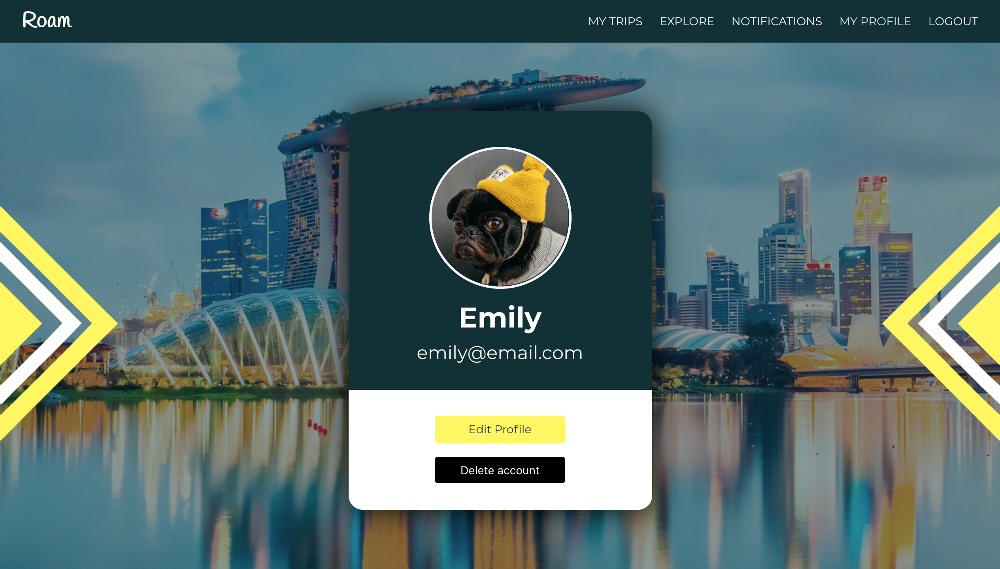

# Software Engineering Immersive: Project 4 (Solo Project)
This is the final project I completed during the General Assembly Software Engineering Immersive course (Week 12).

---

# ROAM

Roam is a trip planning app where users can create boards to organise upcoming trips or collate memories of past trips by pinning photos, posting links to attractions and adding to the to-do list. There are also map and weather features showing the destination location and current weather and temperature.

Users have the ability to share boards with others attending the trip or make the trip open to all so that other users can request to join. Each user has a notifications page where they can view and manage their pending offers and invitations.

## Built With

1. HTML5
2. SCSS
   <!-- * Bulma -->
3. JavaScript
   * ECMAScript6
   * React
   * Axios
4. Python
   * Django
5. SQL
   * PostgreSQL
6. GitHub

## Deployment

This project is deployed on Heroku and can be found here: https://roam-trips.herokuapp.com/

## Getting Started

Use the clone button to download the source code. In the terminal, enter the following commands:

To install all the packages listed in the package.json:
```
$ yarn
```
Navigate into the shell:
```
$ pipenv shell
```
Run the app on your localhost:
```
$ python manage.py runserver
```
Check the console for any issues, and if there are any, check the package.json for any dependencies missing.

Navigate to http://localhost:8000/

## User Experience

### __Home, Register & Login__

The user lands on the homepage, where they can login or register. Users have to be logged into an account to view all content on the site.

**Sample login details**  
Email: emily@email.com  
Password: pass


### __My Trips__

The user can view all trips they are currently attending, whether they are trips they have created or ones that other users have shared with them. From this page they can navigate to boards for upcoming trips or view and add memories from past trips.


### __Create a Trip__

The user can create a new trip board by typing in the destination and selecting the dates of the trip. They are then taken to an empty board of the trip, ready to populate/pin any information they wish about their trip.


### __Trip Board (My/Public)__

If a user selects to view one of their trips, they can view, add and delete pinned photos, links to attractions and items on the to-do list. There are also map and current weather features that I built using Mapbox and the Open Weather API. On this page, users are also able to amend their trip dates, enter an email to share the trip with another user and toggle between the trip being private or open to the public. 

If a user is viewing the board of a trip that they are not attending, a view-only version of the board is displayed, which permits the user from editing any of the trip information.


### __Explore__

The explore page is the same format as the 'My Trips' page but is populated with open trips created by other users, allowing people to explore and potentially join other trips.


### __Notifications__

Users can navigate to their Notifications page, which will display any requests to join their open trips or any notifications that someone has shared a trip board with them for them to join.


### __Profile/Edit__

The user can view their profile page, where they have the option edit their profile information, change their profile picture or delete their account.



## Planning/Project Management

In order to plan the back-end models and any relationships between them, I created the below ERD: 


To visualise the layout and design of the front-end I produced the below wireframes:


## Featured Code

--- BACK-END ---

The below snippet shows the Trip model and the linked Photo, Attraction and ToDo models:

```js
class Trip(models.Model):
  destination = models.CharField(max_length=50)
  start_date = models.DateField()
  end_date = models.DateField()
  open_trip = models.BooleanField(default=False)
  owner = models.ForeignKey(User, related_name="trip", null=True, on_delete=models.CASCADE)

  def __str__(self):
    return self.destination

class Photo(models.Model):
  image = models.CharField(max_length=300)
  trip = models.ForeignKey(Trip, related_name="photos", null=True, on_delete=models.CASCADE)

  def __str__(self):
    return f'Photo {self.id} - {self.trip}'

class Attraction(models.Model):
  link = models.CharField(max_length=300)
  trip = models.ForeignKey(Trip, related_name="attractions", null=True, on_delete=models.CASCADE)

  def __str__(self):
    return f'Attraction {self.id} - {self.trip}'

class ToDo(models.Model):
  to_do = models.CharField(max_length=300)
  trip = models.ForeignKey(Trip, related_name="to_dos", null=True, on_delete=models.CASCADE)

  def __str__(self):
    return f'To do {self.id} - {self.trip}'  
```

User serializer:

```js
class UserSerializer(serializers.ModelSerializer):

    password = serializers.CharField(write_only=True)
    password_confirmation = serializers.CharField(write_only=True)

    def validate(self, data):
        password = data.pop('password')
        password_confirmation = data.pop('password_confirmation')
        
        if password != password_confirmation:
            raise serializers.ValidationError({'password_confirmation': 'Passwords do not match'})
        data['password'] = make_password(password)
        return data

    class Meta:
        model = User
        fields = '__all__'
```

--- FRONT-END ---

The below code snippet shows the functions that run when a user request to share a trip with another user. This process involves retrieving the user's current trip share data, adding the selected trip data and sending a put request to update the user's profile with the shared trip. This will then appear in the user's notifications, enabling them to join the trip if they wish.

```js
  getUserShares = async userId => {
    try {
      const { data } = await axios.get(`/api/${userId}/`, {
        headers: { Authorization: `Bearer ${Auth.getToken()}` }
      })
      const filteredIds = data.trip_shares.map(trip_share => {
        return trip_share.id
      })
      this.setState({ shareData: { trip_shares: [...filteredIds] } }, () => {
        this.addTripShare(userId)
      })
    } catch (err) {
      console.log(err)
    }
  }

  addTripShare = async userId => {
    const tripId = parseInt(this.props.match.params.id)
    this.setState({ shareData: { trip_shares: [...this.state.shareData.trip_shares, tripId] } }, () => {
      this.completeShare(userId)
    })
  }

  completeShare = async userId => {
    try {
      await axios.put(`/api/${userId}/`, this.state.shareData, {
        headers: { Authorization: `Bearer ${Auth.getToken()}` }
      })
      this.setState({ shareUser: { email: '' } })
      notify.show(this.state.message, 'success', 3000)
    } catch (err) {
      console.log(err)
    }
  }
  ```

 The below functions run when a user accepts a share request from their notifications page, adding the shared trip to their list of trips they are attending:

 ```js
 joinTrip = (tripId) => {
    const newTripShares = this.state.tripData.trip_shares.filter(trip_share => {
      return trip_share.id !== tripId
    })
    const filteredIds = newTripShares.map(trip => {
      return trip.id
    })
    this.setState({ tripData: { trips: [...this.state.tripData.trips, tripId], trip_shares: filteredIds } }, () => {
      this.assignTrip()
    })
  }

  assignTrip = async () => {
    const userId = Auth.getUser()
    try {
      await axios.put(`/api/${userId}/`, this.state.tripData, {
        headers: { Authorization: `Bearer ${Auth.getToken()}` }
      })
      notify.show('You have been added to the trip!', 'success', 3000)
      this.props.history.push('/mytrips')
    } catch (err) {
      this.setState({ errors: err.response.data })
    }
  }
  ```

## Wins and Key Learnings

- When I took on this project, I had only been learning Python, Django and PostgreSQL for one week, so creating a fully functional back-end felt like a huge task. As it was my final project on the course, I decided to take it on as a solo project to prove to myself that I could build a full stack app on my own from start to finish.

  By the end of the project week, having a full stack app complete with a back-end built using these newly learned languages was a huge accomplishment for me and, after building an app that I would actually find useful in my own life, made me excited for all the amazing apps I would now be able to create.


## Challenges and Future Improvements

- There is a small bug that appears when a user requests to join another user's trip. When the request is made, it sends a notification to the trip creator informing them that someone would like to join the selected trip, but it does not display the name of the requestee. 

  When I first created the User model, I didn't think users' names would be necessary as users login using their email addresses, however to make the join requests more useful I could fix this easily by adding a name field into the User model.

- With more time, I planned to add a social aspect to the app for those travelling to multiple cities/countries by incorporating an image feed, where users could post updates, and a chat feature enabling travellers to communicate fully with other travellers. Users would have the option to display their current city on their profile, enabling users in the same locations to connect and meet up with other travellers heading to the same destinations.

- Another future improvement would be to make the app fully responsive so that travellers could use it on the go.
